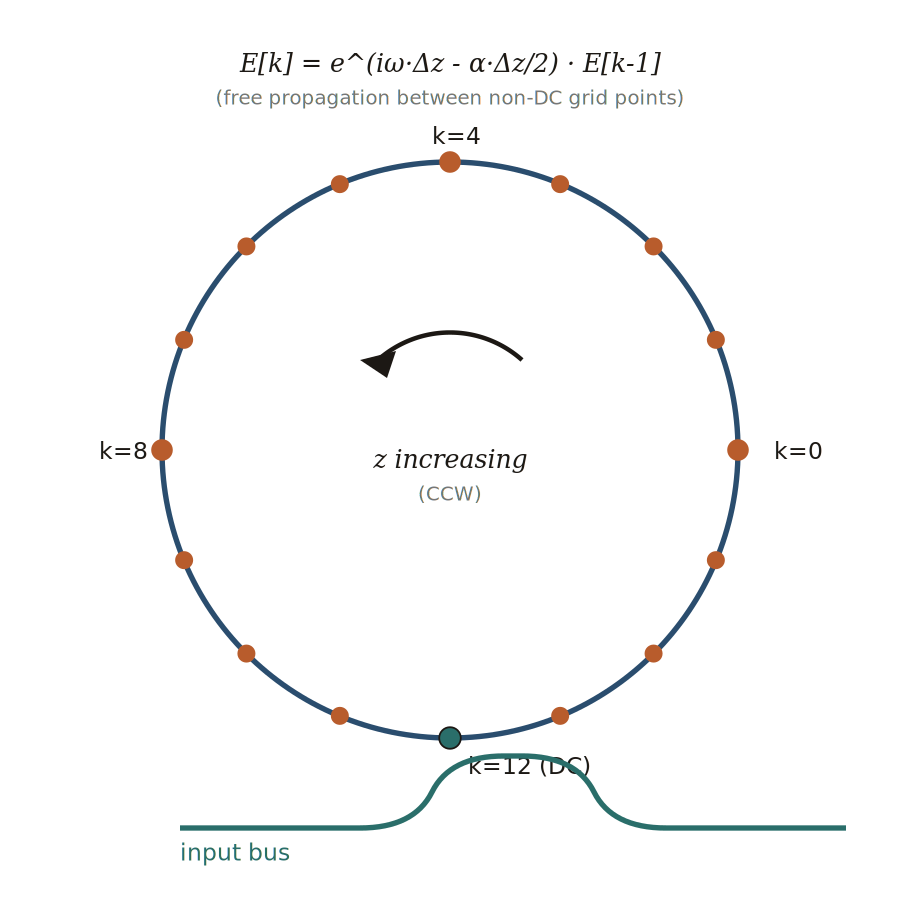
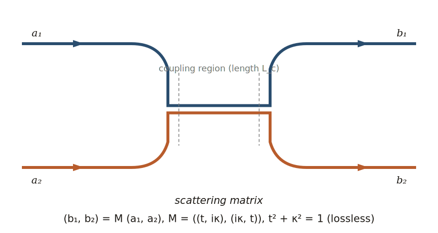
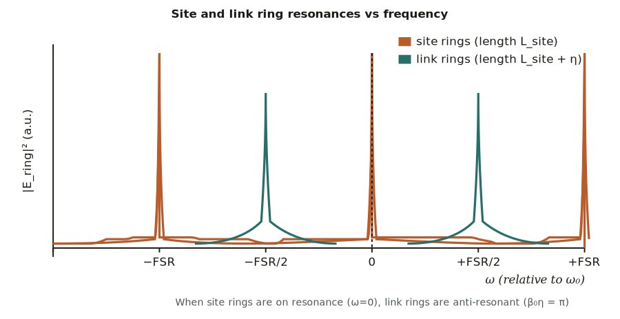
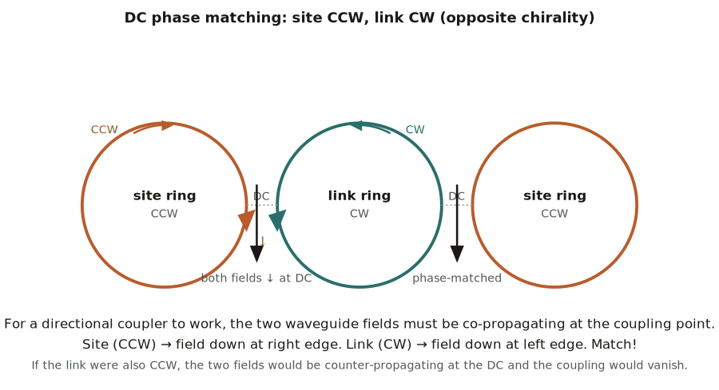
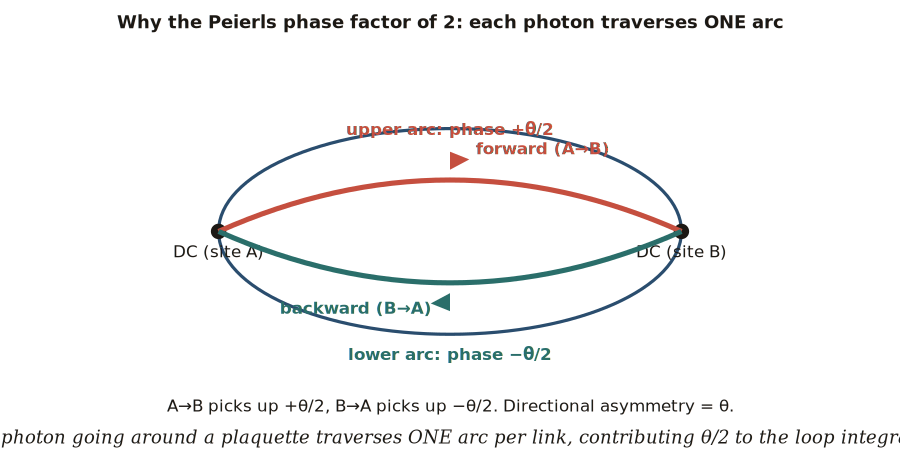
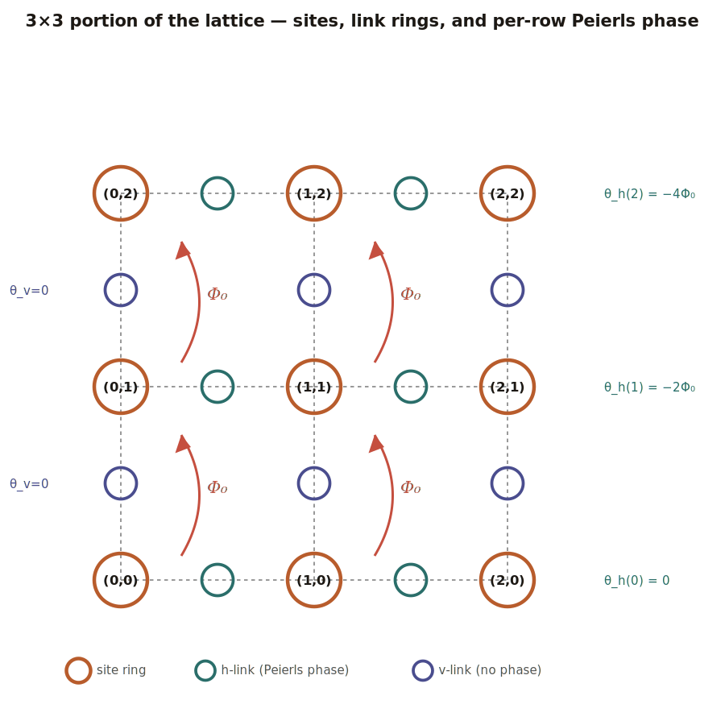
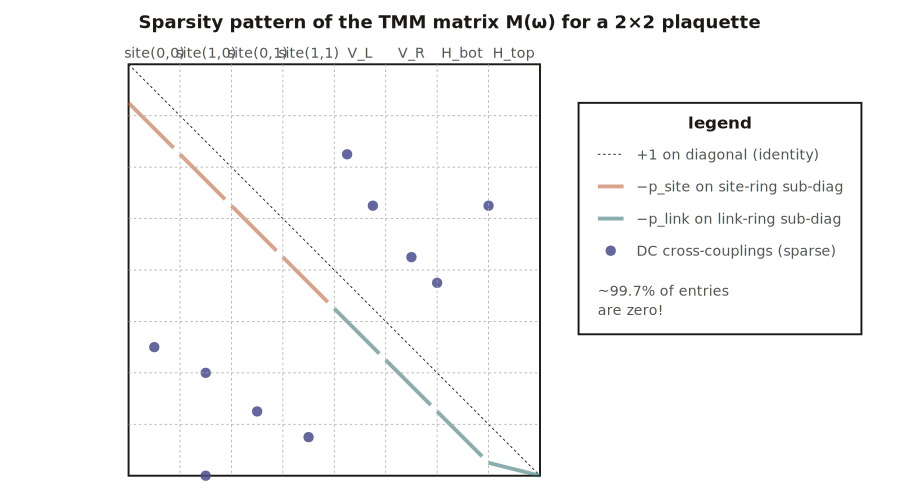
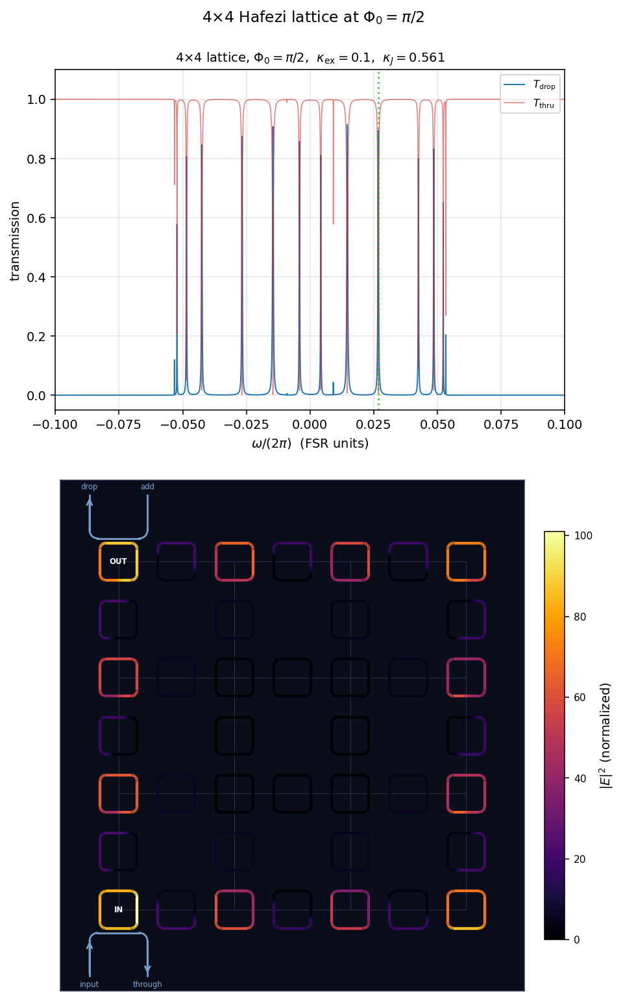

# The Hafezi-Lattice TMM Simulation: Theory and Implementation Guide

This document explains the physics, the algorithm, and the parameter choices behind `lattice_NxN_TMM.py` — a $z$-discretized **transfer-matrix-method** (TMM) simulation of the Hafezi-style coupled-resonator lattice with synthetic magnetic flux. The goal is twofold: (1) to be a self-contained learning resource you can read end-to-end, and (2) to be precise enough that someone could re-implement the code from the description alone.

---

## Contents

1. [What the simulation models](#1-what-the-simulation-models)
2. [Single ring as a TMM building block](#2-single-ring-as-a-tmm-building-block)
3. [The directional coupler](#3-the-directional-coupler)
4. [Anti-resonance: the trick that makes the lattice work](#4-anti-resonance-the-trick-that-makes-the-lattice-work)
5. [Chirality and phase-matched DCs](#5-chirality-and-phase-matched-dcs)
6. [Synthetic flux via Peierls phase](#6-synthetic-flux-via-peierls-phase)
7. [Assembling the lattice and the linear system](#7-assembling-the-lattice-and-the-linear-system)
8. [Numerical strategy: sparse solver](#8-numerical-strategy-sparse-solver)
9. [Parameter glossary](#9-parameter-glossary)
10. [How to read the output](#10-how-to-read-the-output)
11. [References](#11-references)

---

## 1. What the simulation models

A 2D lattice of identical "site" microring resonators is connected by smaller "link" rings. Each pair of nearest-neighbor site rings is coupled to one link ring via two evanescent directional couplers (DCs), so the link ring sits between sites and acts as a mediator. This is the platform of [Hafezi *et al.*, *Nature Photonics* **7**, 1001 (2013)](https://doi.org/10.1038/nphoton.2013.274).

When the link rings are tuned to be **anti-resonant** with the site rings (length offset such that $\beta_0 \eta = \pi$), the link rings carry no resonant build-up but do mediate hopping between sites. The site rings then realize an effective tight-binding model, which can be made into a **synthetic magnetic flux** $\Phi_0$ per plaquette by giving link rings a directional asymmetry (a Peierls phase). At $\Phi_0 = \pi/2$ the system realizes the Hofstadter model with a topologically nontrivial gap and chiral edge states — directly analogous to the integer quantum Hall effect, but for photons.

The TMM here computes the steady-state field amplitude inside *every waveguide segment of every ring* at a given input frequency $\omega$, by solving one linear system per frequency. From those fields we get drop and through transmission spectra and intensity distributions across the lattice — enough to visualize edge modes directly.

---

## 2. Single ring as a TMM building block

Forget the lattice for a moment and think about one ring. The ring is a closed waveguide of length $L$. A photon at angular frequency $\omega$ propagating along the waveguide picks up a phase per unit length given by the propagation constant

$$
\beta(\omega) = \beta_0 + \frac{\omega - \omega_0}{v_g},
$$

where $\beta_0 = \beta(\omega_0)$ is the propagation constant at the carrier frequency $\omega_0$, $v_g$ is the group velocity, and we'll re-define "$\omega$" as the *detuning* from $\omega_0$ throughout the rest of the document. Going around the ring once gives a round-trip phase $\beta L = \beta_0 L + \omega L / v_g$. Resonance occurs when $\beta_0 L = 2\pi N$ for integer $N$ — the static integer-multiple-of-$2\pi$ condition we'll absorb into the definition of "$\omega = 0$".

In dimensionless units ($v_g = 1$, $L_{\rm site} = 1$), the round-trip phase from detuning alone is just $\omega L$, and $\omega = 0$ is the resonance.

### Z-discretization

We sample the field at $N_z$ equally-spaced points around the ring. Call the field amplitude at grid point $k$ (where $k = 0, 1, \dots, N_z - 1$) by $E_k$. Between adjacent grid points the field just propagates a short distance $\Delta z = L/N_z$, so

$$
E_k = e^{i\omega \Delta z}\, e^{-\alpha \Delta z / 2}\, E_{k-1} \;\equiv\; p\, E_{k-1}.
$$

Here $\alpha$ is a phenomenological linear loss (intensity loss per unit length), and the per-step propagation factor is

$$
p = e^{i\omega \Delta z - \alpha \Delta z / 2}.
$$

After $N_z$ steps you've gone all the way around: $E_{N_z} = p^{N_z} E_0 = e^{i\omega L - \alpha L/2} E_0$. Setting $E_{N_z} = E_0$ enforces the ring's standing-wave (resonance) condition. With finite loss, the round trip cannot be perfectly closed without an external drive — the ring needs to be excited from outside.

<p align="center">
  
</p>

The ring becomes an external-driven resonator the moment you punch a hole in the loop where another waveguide can couple in. That's the directional coupler.

---

## 3. The directional coupler

A directional coupler (DC) is a place where two parallel waveguides come close enough that their evanescent fields overlap. In TMM the effect of the entire coupling region is a 2×2 unitary scattering matrix relating the input amplitudes $(a_1, a_2)$ to the output amplitudes $(b_1, b_2)$:

$$
\begin{pmatrix} b_1 \\ b_2 \end{pmatrix}
=
\begin{pmatrix} t & i\kappa \\ i\kappa & t \end{pmatrix}
\begin{pmatrix} a_1 \\ a_2 \end{pmatrix},
\qquad t^2 + \kappa^2 = 1.
$$

The "self-coupling" $t$ is the amplitude that stays on the same waveguide, and the "cross-coupling" $i\kappa$ is the amplitude that hops to the other. The factor of $i$ is what makes the DC unitary (and is required for energy conservation in the lossless limit). In our code, $\kappa$ is a real number between 0 and 1 — small for weak coupling, large for strong coupling.

<p align="center">
  
</p>

In the lattice, every ring has multiple DCs around its perimeter:
- Site rings have one DC for the input/drop bus (if it's a bus site) and one DC for each of up to four neighboring link rings.
- Link rings have two DCs (one to each of the two neighboring site rings).

We place each DC at one specific grid point on the ring. So in the discretization, a DC is just an *exception* to the simple "$E_k = p \cdot E_{k-1}$" rule at one $k$ value — at that $k$, instead of pure propagation we apply the DC scattering matrix mixing this ring's field with a partner ring's field.

The code uses these slot positions on a 16-point site ring:

```
SLOT_BUS    = 0    # bus DC (only used for IN and OUT site rings)
SLOT_RIGHT  = 4    # DC to right-neighbor h-link (if present)
SLOT_TOP    = 8    # DC to top-neighbor v-link
SLOT_BOTTOM = 10   # DC to bottom-neighbor v-link
SLOT_LEFT   = 12   # DC to left-neighbor h-link
```

Note the slots aren't perfectly evenly spaced — TOP at 8 and BOTTOM at 10 are close together. That's fine because no site ring ever has *both* TOP and BOTTOM neighbors active simultaneously and use both: a corner ring has only one of these, so the asymmetry doesn't cause physical conflicts. It just affects how the rendered ring is rotated for visualization.

Link rings have just two DCs:
- "near" DC at grid 0, couples to the lower-coordinate site (left site for h-links, bottom site for v-links).
- "far" DC at grid $N_z/2$, couples to the higher-coordinate site.

---

## 4. Anti-resonance: the trick that makes the lattice work

Here is the central physical idea of the Hafezi platform.

If the site rings and link rings were both on resonance at $\omega = 0$, you'd have a degenerate forest of resonances and the system would be a mess. To make the link rings act as *passive couplers* — fast paths between sites without their own mode structure interfering — you tune them to be **anti-resonant** with the site rings.

Concretely: make the link rings physically *longer* than the site rings by exactly $\eta = \lambda_0 / (2 n_{\rm eff})$ — half a wavelength at the operating wavelength $\lambda_0$. Then the static propagation phase $\beta_0 \eta = \pi$ makes the link's round-trip phase

$$
\beta_0 L_{\rm link} = \beta_0 (L_{\rm site} + \eta) = 2\pi N + \pi,
$$

which is an *odd* multiple of $\pi$ — anti-resonant — when the site round-trip is $2\pi N$ (resonant). Because $\beta_0$ is set by the operating wavelength, this is a geometric constraint on the fabricated lengths, not a frequency-dependent thing.

<p align="center">
  
</p>

In the simulation, we treat $\omega$ as *detuning from the site resonance*. The site round-trip phase is $\omega L_{\rm site}$, with resonance at $\omega = 0$. The link ring's round-trip phase is

$$
\omega L_{\rm link} + \beta_0 \eta \;=\; \omega(L_{\rm site} + \eta) + \pi.
$$

So in the per-step propagation factor for the link ring we add a constant extra phase $\pi / N_z$ (so the full round trip picks up $+\pi$):

$$
p_{\rm link} = e^{i \omega \Delta z_{\rm link} + i\pi/N_z - \alpha \Delta z_{\rm link} / 2}.
$$

This is the line of code

```python
beta0_eta = np.pi if half_fsr_offset else 0.0
extra_per_step_phase = beta0_eta / Nz_link
p_link = np.exp(1j * omega * dz_link + 1j * extra_per_step_phase
                 - alpha * dz_link / 2.0)
```

The boolean `half_fsr_offset` is the geometric anti-resonance condition. Without it, link rings would also resonate at $\omega = 0$ and you'd get nonsense.

**What you'll see in the spectrum:** two clusters of supermodes, separated by half a link-ring FSR (in the convention of $L_{\rm link} = 1.5 L_{\rm site}$, this means the link cluster is at $\omega/(2\pi)_{\rm site} \approx \pm 1/3$). The cluster near $\omega = 0$ is *site-dominated* — site rings ring up, link rings stay dim. The cluster near $\omega/(2\pi) = \pm 1/3$ is *link-dominated*, with the roles swapped.

When sites are bright, the link rings carry small but nonzero field — they're transmitting (not building up) the photon between sites. The smaller the bus coupling $\kappa_{\rm ex}$, the sharper the resonances; the smaller the link coupling $\kappa_J$, the smaller the effective hopping.

---

## 5. Chirality and phase-matched DCs

Microrings support two whispering-gallery modes: clockwise (CW) and counter-clockwise (CCW). For a directional coupler between two rings to actually couple, the two waveguide fields must be **co-propagating** at the coupling point. If one ring is CCW at the DC and the other is CW at the DC, and the DC sits on the inside of one ring and the outside of the other, then locally both fields move in the same direction — phase matched, energy can flow from one to the other.

In the Hafezi convention, **site rings circulate CCW and link rings circulate CW** (or vice versa). This means at every site-link DC, the two fields are co-propagating. If both rings were CCW (or both CW), the DC would couple counter-propagating modes, and at a directional coupler this gives essentially zero coupling — phase mismatch.

<p align="center">
  
</p>

In the code, the direction "$z$ increasing" corresponds to the photon's direction of propagation. For site rings I set `chirality = +1` (visualized CCW). For link rings I set `chirality = -1` (visualized CW). Internally, both ring types just propagate $E_k = p \cdot E_{k-1}$ — the chirality flag only affects how grid indices are mapped to angular positions when the ring is *drawn* on the figure.

### Bus chirality

The IN and OUT buses are straight waveguides, not rings. They don't have their own circulation, but they do have a propagation direction. For phase-matched coupling at the bus DC:

- **IN bus** sits below the IN site ring. The IN site ring is CCW, so at its bottom edge the field locally moves *rightward*. The IN bus must therefore carry light *rightward* through the coupling section: input on the left tail, through on the right tail.
- **OUT bus** sits above the OUT site ring. At the top edge of a CCW ring, the field moves *leftward*. So the OUT bus carries light *leftward*: drop on the left tail, add (unused) on the right tail.

This is what the visualization shows.

---

## 6. Synthetic flux via Peierls phase

To make this lattice topological, we want a *uniform magnetic flux* $\Phi_0$ through every plaquette of the lattice. In a continuous photonic system there's no actual magnetic field, so we need a synthetic mechanism: making the photon hopping between sites pick up a phase that's direction-dependent, exactly as the Peierls substitution would predict for a charged particle in a magnetic field.

In a microring lattice this is achieved by giving each link ring an asymmetric optical path length: the upper arc and lower arc of the link ring have slightly different lengths. A photon traversing the link from site A to site B (forward) takes one arc; the reverse direction takes the other arc. The two paths pick up slightly different phases, so $J_{AB}$ and $J_{BA}$ are not complex conjugates but $J_{AB} = J^* e^{i\theta}$ — a Peierls phase.

In the simulation, I implement this by adding $+\theta/2$ to one specific propagation step on the link ring's "forward arc" (between grid 0 and grid 1) and $-\theta/2$ on the "backward arc" (between grid $N_z/2$ and grid $N_z/2 + 1$). The total round-trip phase of the link is unchanged, but the two halves carry different directional phases.

### The factor of 2

Here's a subtle point that took me a while to get right. The naive expectation: if I want plaquette flux $\Phi_0$, I just put $\theta = \Phi_0$ on one bond. But that's wrong by a factor of 2.

Why: a photon going around a plaquette traverses **one arc of each link ring** (the arc that connects from one site DC to the next site DC). It doesn't traverse the link's full round trip. So the phase contribution per link is $\theta/2$ (half the directional asymmetry), not $\theta$.

<p align="center">
  
</p>

To get plaquette flux $\Phi_0$, the directional asymmetry on the relevant link must be $\theta = 2\Phi_0$. I verified this by comparing the simulated supermode spectrum at $\Phi_0 = \pi/2$ to the analytical 4-site Hofstadter eigenvalues $\pm \sqrt{2 \pm \sqrt{2}}\,J$: with $\theta = -2\Phi_0$ the four predicted modes appear at the right positions to within 1%; with $\theta = -\Phi_0$ they're off by exactly a factor of 2 in the splitting.

### The Landau gauge

For the lattice to have *uniform* flux, the per-link asymmetry has to depend on position in a specific way (a "gauge choice"). The simplest is **Landau gauge**, where only horizontal links carry asymmetry, and that asymmetry depends linearly on the row index $i_y$:

$$
\theta_h(i_y) = -2 \Phi_0 \cdot i_y, \qquad \theta_v = 0.
$$

Going around any plaquette CCW (corners $(i_x, i_y) \to (i_x+1, i_y) \to (i_x+1, i_y+1) \to (i_x, i_y+1) \to (i_x, i_y)$), only the bottom and top h-links contribute, and the sum is

$$
\big[\theta_h(i_y) - \theta_h(i_y + 1)\big] / 2 \;=\; \big[(-2\Phi_0 i_y) - (-2\Phi_0(i_y+1))\big]/2 \;=\; \Phi_0.
$$

Uniform across the lattice.

<p align="center">
  
</p>

---

## 7. Assembling the lattice and the linear system

The full state vector $\vec E$ contains the field amplitude at every grid point of every ring. For a $4 \times 4$ lattice with $N_z = 16$ for both sites and links:

- 16 site rings × 16 grid points = 256
- 24 link rings (12 horizontal + 12 vertical) × 16 grid points = 384
- **Total: 640**

For each grid point, the simulation writes one linear equation. There are two cases.

### Free propagation (most grid points)

If grid point $k$ has no DC, the equation is just

$$
E_k - p\, E_{k-1} = 0,
$$

i.e., the propagation factor relates this point to its predecessor.

### Directional coupler (a few grid points)

If grid point $k$ does have a DC, it mixes this ring's field with a partner ring's field. Suppose this is the site-ring side of a site-link DC. Then the equation is

$$
E^{\rm site}_k = t\, p_{\rm site}\, E^{\rm site}_{k-1} + i\kappa\, p_{\rm link}\, E^{\rm link}_{k_{\rm link, prev}},
$$

where $E^{\rm link}_{k_{\rm link, prev}}$ is the field at the partner DC's grid point on the link ring (with the link's propagation factor and any Peierls extra phase included). The corresponding equation on the link side mirrors this. For the bus DC, the equation is

$$
E^{\rm site}_k = t\, p_{\rm site}\, E^{\rm site}_{k-1} + i\kappa_{\rm ex}\, s_{\rm in},
$$

with $s_{\rm in}$ the bus input amplitude (set to 1 in our code; the through and drop outputs are computed from the converged $\vec E$).

### Linear system

Stack all $n = N_z(N_{\rm site} + N_{\rm link})$ equations:

$$
[\,I - R(\omega)\,]\, \vec E \;=\; \vec s_{\rm drive},
$$

where $I$ is the identity, $R(\omega)$ is the *round-trip operator* containing all the propagation and DC mixings (which depends on $\omega$ through the propagation factors), and $\vec s_{\rm drive}$ has $i\kappa_{\rm ex}$ at the bus-input row and zero elsewhere.

This is a sparse linear system: each row has at most 2 nonzero entries (one from $I$ on the diagonal, one from $-R$ on a sub-diagonal or off-block-diagonal entry).

<p align="center">
  
</p>

Solve it once per frequency $\omega$. Done. The state vector $\vec E$ then gives:
- The field intensity $|E_k|^2$ at every grid point of every ring (used for visualization).
- The bus through and drop transmission via $s_{\rm thru} = t_{\rm ex} + i\kappa_{\rm ex} \cdot E^{\rm bus\_in\, side}$ and $s_{\rm drop} = i\kappa_{\rm ex} \cdot E^{\rm bus\_drop\, side}$.

---

## 8. Numerical strategy: sparse solver

The matrix $M = I - R(\omega)$ is $n \times n$ where $n = 640$ for the 4×4 lattice, but it has only $\sim 2$ nonzeros per row. The sparsity is over 99.7%. So:

- **Dense `np.linalg.solve`**: $O(n^3) \approx 2.6 \times 10^8$ flops per frequency. ~25 ms.
- **Sparse `scipy.sparse.linalg.splu().solve()`**: exploits the sparsity. ~0.8 ms per frequency.

That's a 30× speedup. For 8001 frequencies the difference is 3.5 minutes vs 7 seconds. The code in `lattice_NxN_TMM.py` ships with the sparse version (`solve_lattice_fast`, `scan_spectrum_fast`).

The sparsity pattern only depends on `(Nx, Ny, Nz_site, Nz_link)`, not on $\omega$. So the (row, col) coordinates are precomputed once and cached; only the entry values change per frequency. Avoiding rebuilding the sparse matrix from a Python loop each call accounts for most of the speedup.

For really large lattices ($N_x \times N_y \gtrsim 10$) where even sparse LU is slow, the next step would be parallelizing the frequency scan across CPU cores via `multiprocessing`, since each frequency is independent. JAX-on-GPU could vectorize the scan via `vmap`, but at current problem sizes the GPU overhead beats the speedup.

---

## 9. Parameter glossary

| Parameter | Symbol | Role |
|---|---|---|
| `Nx, Ny` | $N_x, N_y$ | Lattice dimensions in sites. The lattice has $N_x N_y$ site rings, $(N_x{-}1)N_y + N_x(N_y{-}1)$ link rings, $(N_x{-}1)(N_y{-}1)$ plaquettes. |
| `Phi0` | $\Phi_0$ | Synthetic flux per plaquette (radians). $\Phi_0 = \pi/2$ gives the "nice" Hofstadter case with 4 sub-bands. |
| `eta` | $\eta$ | Physical link-ring extra length beyond a site length. Set to 0.5 in our dimensionless units. The actual *anti-resonance* condition is set by `half_fsr_offset` (below). |
| `half_fsr_offset` | — | If `True`, adds the static $\beta_0 \eta = \pi$ phase to link round-trips, making links anti-resonant with sites at $\omega = 0$. **Should always be `True` for Hafezi physics.** |
| `kappa_ex` | $\kappa_{\rm ex}$ | Bus↔site DC field coupling. Sets resonance linewidth (loaded Q). Larger = broader peaks. |
| `kappa_J` | $\kappa_J$ | Site↔link DC field coupling. Sets effective hopping rate $J$ between sites. Larger = larger Hofstadter bandwidth. |
| `alpha` | $\alpha$ | Linear loss per unit length. $1\times10^{-4}$ is approximately lossless on the FSR scale. |
| `Nz_site, Nz_link` | $N_z$ | Number of grid points per ring. 16 each is plenty for site clusters; increase if you want sharper resolution of fine link-ring standing waves. |
| `bus_in, bus_drop` | — | Site coordinates of the input and drop buses. Default is $(0, 0)$ and $(0, N_y - 1)$ — left edge column. |

### Calibration: getting $J / \text{FSR}$

In a real Hafezi experiment, $J / \text{FSR} \approx 1/40$ (e.g. $J \approx 25$ GHz with FSR $\approx 1$ THz). To match this in the simulation, you can empirically scan $\kappa_J$ and measure the resulting site-cluster supermode splitting. With $\kappa_J = 0.561$, $\eta = 0.5$, `half_fsr_offset=True`, the site-cluster spacing matches the analytical 4-site Hofstadter prediction at $\Phi_0 = \pi/2$ to within 1%, with $J / \text{FSR} \approx 1/40$.

To work in a different regime, just change $\kappa_J$ — but watch out for the $\kappa_J^2$ factor: doubling $J$ requires $\kappa_J \to \kappa_J \sqrt{2}$, not $\kappa_J \to 2\kappa_J$.

---

## 10. How to read the output

The default demo runs the 4×4 lattice at $\Phi_0 = \pi/2$, scans the central FSR window $\omega/(2\pi) \in [-0.1, 0.1]$, finds spectrum peaks, and plots:

- **Top**: the through (red) and drop (blue) transmission vs $\omega/(2\pi)$ in FSR units.
- **Bottom**: a snapshot of $|E|^2$ at the chosen peak frequency, drawn as colored ring outlines on a dark background. The bus waveguides are drawn as horseshoes hugging the IN and OUT site rings.

### What to look for

1. **Peak count.** At $\Phi_0 = \pi/2$, the 4×4 lattice has 16 site supermodes (organized into 4 Hofstadter sub-bands of 4 modes each). All should be visible in the central site cluster.

2. **Sub-band structure.** The 16 peaks cluster into 4 mini-clusters separated by mini-gaps. The biggest gap is at $\omega = 0$ — this is the topological gap that hosts the chiral edge mode.

3. **Edge mode**. At a frequency in the topological gap (e.g., $\omega/(2\pi) \approx 0.025$, just inside the gap), the field distribution should show:
   - Bright site rings along the **boundary** of the lattice (top, bottom, left, right edges).
   - **Dark interior bulk** — the topological gap forbids bulk transport.
   - The field flows chirally around the boundary from IN to OUT.

4. **Anti-resonant link rings**. At a site-cluster frequency, link rings appear dim relative to site rings. They're carrying transmitted (not built-up) field. At a link-cluster frequency (around $\omega/(2\pi) \approx \pm 1/3$, outside the central window), the picture flips: link rings light up, sites go dim.

5. **Standing-wave structure inside link rings**. Even at the site cluster, link rings have visibly non-uniform intensity around their perimeter — one side brighter than the other. This is the off-resonant standing wave from being driven at one DC and tapped at the other.

### What the default 4×4 demo produces

<p align="center">
  
</p>

Top: the spectrum, $T_{\rm drop}$ in blue and $T_{\rm thru}$ in red, with the selected peak (chosen as the closest peak to $\omega/(2\pi) = 0.025$) marked by the green vertical dashed line.

Bottom: the $|E|^2$ profile rendered around every ring's perimeter. The IN bus and OUT bus are visible as horseshoe-shaped waveguides on the lower-left and upper-left of the lattice. At this peak frequency, the field is bright on the boundary site rings (perimeter of the 4×4 lattice) and dark in the bulk — a textbook chiral edge mode.

---

## 11. References

- M. Hafezi, S. Mittal, J. Fan, A. Migdall, J. M. Taylor, *Imaging topological edge states in silicon photonics*, **Nature Photonics 7, 1001 (2013)**. The original Hafezi platform.
- M. Hafezi *et al.*, *Robust optical delay lines with topological protection*, **Nature Physics 7, 907 (2011)**. The proposal of the link-ring scheme.
- S. Mittal, V. V. Orre, S. Hafezi, *Topologically robust transport of photons in a synthetic gauge field*, **Phys. Rev. Lett. 113, 087403 (2014)**.
- D. Hofstadter, *Energy levels and wave functions of Bloch electrons in rational and irrational magnetic fields*, **Phys. Rev. B 14, 2239 (1976)**. The model the photonic lattice realizes.

---

*This document accompanies `lattice_NxN_TMM.py`. The schematics in `figures/` are SVG and editable.*
